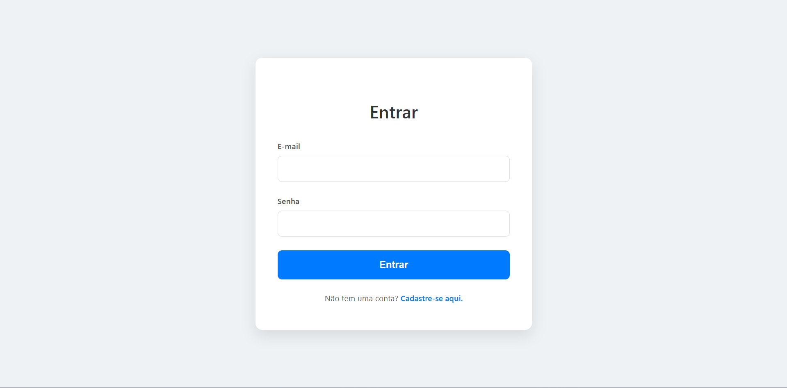
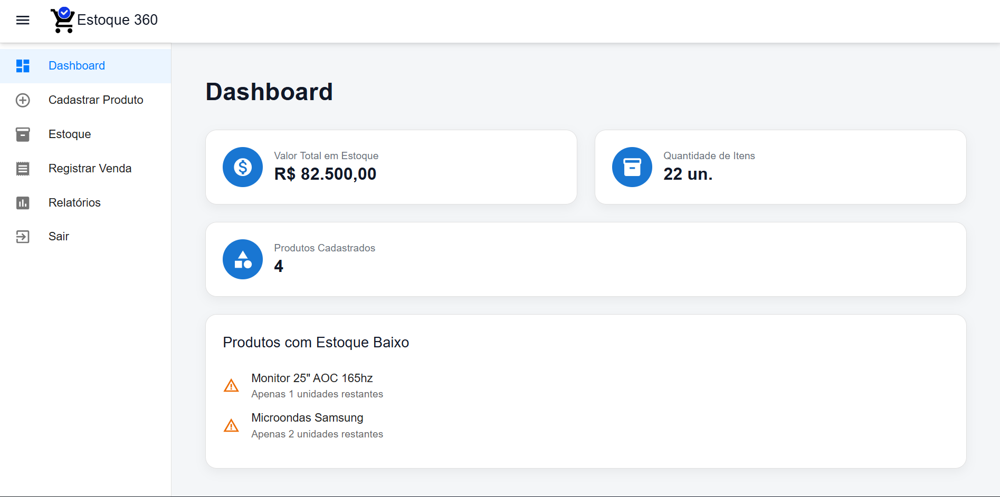
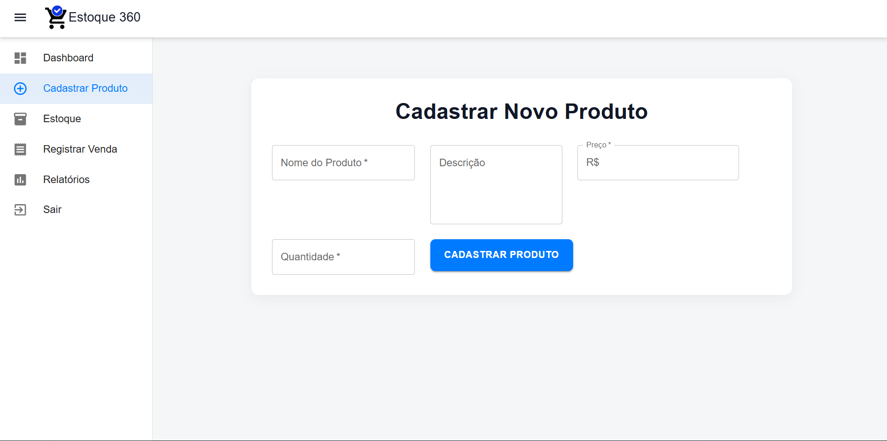
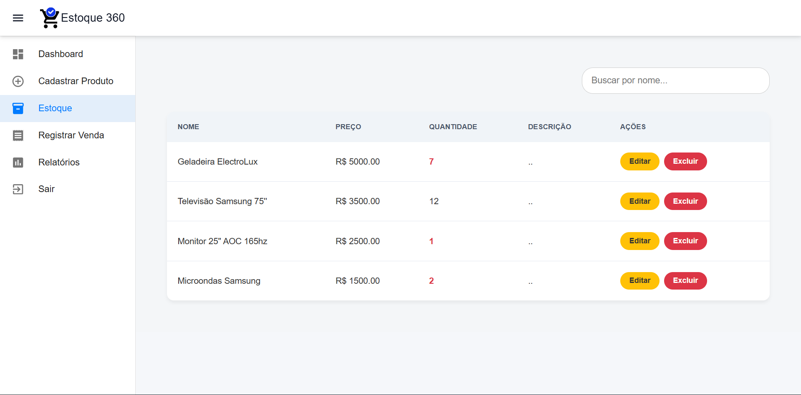
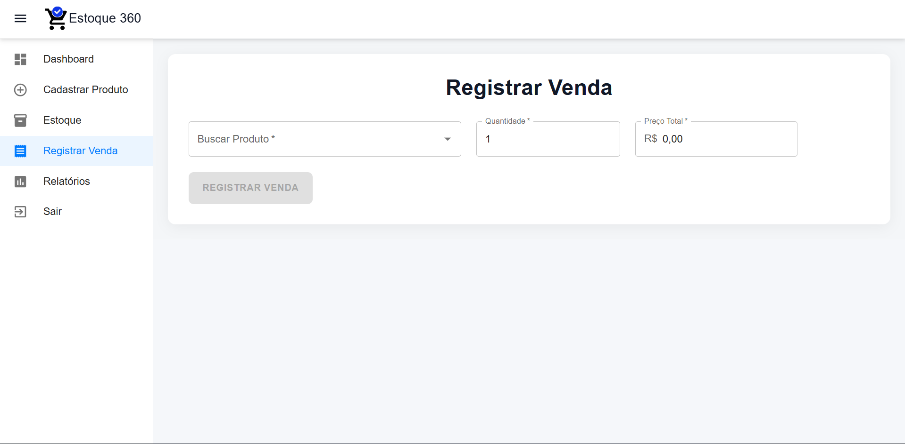
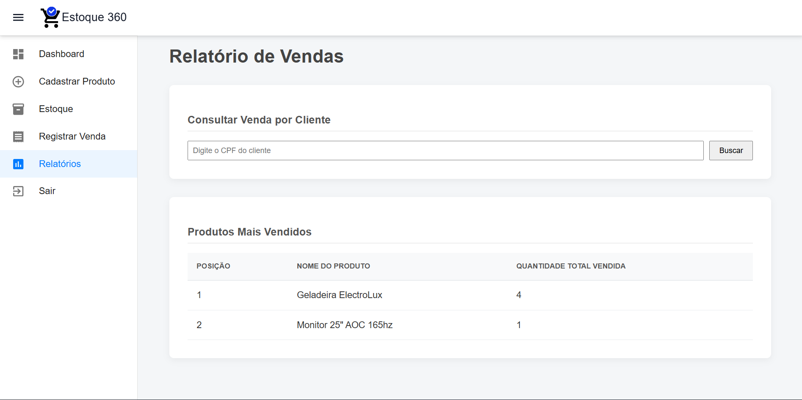
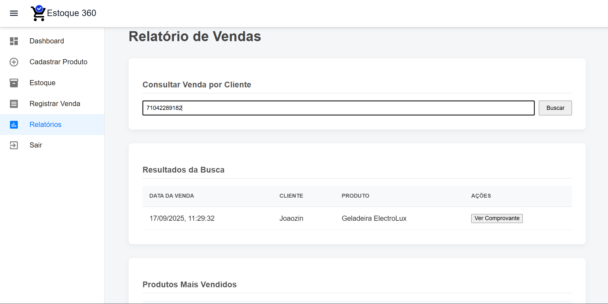

# 📦 Estoque 360

Um sistema completo de **gestão de estoque** para **lojistas de diferentes segmentos**, desenvolvido com **React + Vite (frontend)** e **Node.js + Express + Prisma (backend)**.  
A aplicação possibilita o controle centralizado de produtos, garantindo praticidade no gerenciamento de quantidades, cadastro e monitoramento de inventário.

---

## 📑 Tabela de Conteúdos
- [Introdução](#-introdução)  
- [Recursos](#-recursos)  
- [Arquitetura](#-arquitetura)  
- [Screenshots](#-screenshots)  
- [Instalação](#-instalação)  
- [Configuração](#-configuração)  
- [Uso](#-uso)  
- [Dependências](#-dependências)  
  - [Frontend](#frontend)  
  - [Backend](#backend)  
- [Exemplos de Uso](#-exemplos-de-uso)  
- [Problemas Comuns](#-problemas-comuns)  
- [Contribuidores](#-contribuidores)  
- [Licença](#-licença)  

---

## 🚀 Introdução
O **Estoque 360** é uma aplicação web moderna que auxilia pequenos e médios lojistas no controle de estoque.  
Seu design modular permite evoluir a aplicação para novas funcionalidades sem comprometer a performance.

---

## ✨ Recursos
- Cadastro, edição e exclusão de produtos  
- Controle de quantidades em estoque  
- Registro de vendas  
- Geração de relatórios em **PDF**  
- Emissão de **comprovante de pagamento**  
- Interface intuitiva construída com **Material UI**  
- API segura com autenticação JWT  
- Integração com **Prisma** para gerenciamento de banco de dados  

---

## 📸 Screenshots

### 🔑 Tela de Login


### 📊 Dashboard


### ➕ Cadastro de Produto


### 📋 Estoque


### 🛒 Registro de Vendas


### 📈 Relatórios de Vendas


### 🧾 Comprovante de Pagamento


---

## 🏗 Arquitetura
```
estoque-lojistas/
├── backend/     # API REST em Node.js + Express + Prisma
├── frontend/    # Aplicação em React + Vite
└── README.md
```

- **Frontend**: React 19, Vite, Material UI, Axios, React Router  
- **Backend**: Node.js, Express, Prisma ORM, JWT, bcrypt  
- **Banco de Dados**: Suportado via Prisma (ex.: PostgreSQL, MySQL, SQLite)  

---

## ⚙️ Instalação

### Pré-requisitos
- [Node.js](https://nodejs.org/) (versão 18 ou superior)  
- [npm](https://www.npmjs.com/) ou [yarn](https://yarnpkg.com/)  
- Banco de dados compatível com [Prisma](https://www.prisma.io/) (ex.: PostgreSQL, MySQL, SQLite)

### Clonar o repositório
```bash
git clone https://github.com/guizinxds/estoque-lojistas.git
cd estoque-lojistas
```

### Instalar dependências do backend
```bash
cd backend
npm install
```

### Instalar dependências do frontend
```bash
cd ../frontend
npm install
```

---

## 🔧 Configuração

### Backend
No diretório `backend`, crie um arquivo `.env` com as variáveis necessárias:
```env
DATABASE_URL = "file:./prisma/dev.db"
```

---

## ▶️ Uso

### Rodar o backend
```bash
cd backend
npm start
```

### Rodar o frontend
```bash
cd frontend
npm run dev
```

Acesse a aplicação em:  
👉 [http://localhost:5173](http://localhost:5173)

---

## 📦 Dependências

### Frontend
- React ^19.1.1  
- React Router DOM ^7.8.0  
- Axios ^1.11.0  
- Material UI (^7.3.1)  
- Emotion (styled, react)  
- PDFMake & html-to-pdfmake (relatórios PDF)  
- react-input-mask / react-imask (máscaras de input)  

### Backend
- Express ^5.1.0  
- Prisma ^6.14.0    
- bcrypt ^6.0.0 (hash de senhas)  
- jsonwebtoken ^9.0.2 (autenticação)  
- dotenv ^17.2.2 (variáveis de ambiente)  
- cors ^2.8.5 (controle de acesso)  
- Axios ^1.12.2
---

## 💡 Exemplos de Uso
- **Cadastrar um produto:** nome, descrição, preço e quantidade inicial.  
- **Editar estoque:** atualizar diretamente as quantidades via painel.  
- **Gerar relatório:** exportar lista de produtos em PDF.  
- **Autenticação:** lojista acessa sistema com login seguro (JWT).  

---

## 🛠 Problemas Comuns
- **Erro de conexão com banco:** verifique a string `DATABASE_URL` no `.env`.  
- **Erro de autenticação:** confira o `JWT_SECRET`.  
- **Frontend não comunica com backend:** confirme que as portas estão corretas (`VITE_API_URL`).  
- **Erro de dependências:** execute `npm install` nas duas pastas (`backend` e `frontend`).  

---

## 👨‍💻 Contribuidores
- [@guizinxds](https://github.com/guizinxds) (criador)
- [@hilkerx](https://github.com/hilkerx) (colaborador)

---

## 📜 Licença
Este projeto está sob a licença **MIT**.  
Sinta-se à vontade para usar, modificar e distribuir, desde que mantenha os créditos.  
